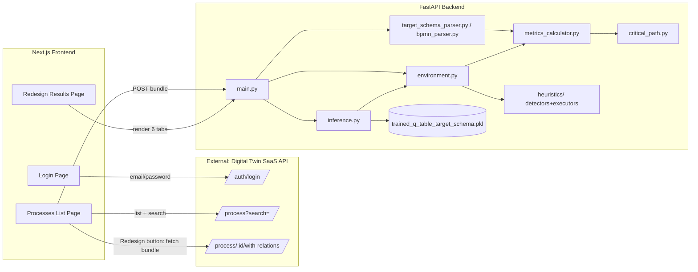

# BPM Redesign Engine — System Documentation

This document explains how the whole system works end to end: what problem it solves, how a process moves through the pipeline, and how each backend and frontend module contributes to the final result.

## 1. What this system does

Given a business process — either a BPMN 2.0 XML file or a process exported from the "Digital Twin" SaaS (a relational JSON schema of tasks, gateways, jobs/roles, and durations) — the system:

1. Parses the process into an internal graph (tasks, gateways, flows, start/end events).
2. Computes AS-IS metrics: **Cycle Time**, **Theoretical Cycle Time**, **Cycle Time Efficiency**, **Critical Path**, **RACI matrix**, and **cost breakdown** (process / rework / waiting).
3. Runs a trained **Q-learning reinforcement-learning agent** that repeatedly picks the best applicable redesign heuristic (Parallelism, Elimination, Automation, Composition, Case-Based Work, Resequencing, Numerical Involvement, Knock-Out, Trusted Party, Extra Resources) and applies it, producing a TO-BE process.
4. Recomputes the same metrics on the TO-BE process and returns a full **before/after comparison**, plus a step-by-step trace of what the agent did and why.
5. Renders the whole thing in a Next.js frontend as a 6-tab report (Flow Analysis, Critical Path, RACI Matrix, BPMN Diagram, Redesign Trace, RL Details).

The RL agent itself was trained **once, offline**, on thousands of synthetic BPMN processes (see [§7](#7-how-the-agent-was-trained-offline-not-at-request-time)). Everything the running application does at request time is *inference* against that already-trained Q-table — it never learns from live traffic.

---

## 2. High-level architecture



Two independent backends exist in the codebase:

- **Legacy BPMN pipeline** (`redesign_process` / `POST /redesign`): takes an uploaded `.bpmn` file, assigns *synthetic* task metrics (random resource/duration/cost) if the file has none, and redesigns it. Used for local testing / arbitrary BPMN files with no real cost data.
- **Target-schema pipeline** (`redesign_target_process` / `POST /redesign/process`): takes a process in the Digital Twin SaaS's own relational JSON schema, with **real** task durations, role rates, and RACI data. This is what the deployed frontend actually uses.

Both pipelines share the same metrics engine, heuristics, environment, and trained Q-table logic — they only differ in how the process is parsed and how realistic the cost/time data is.

---

## 3. The process graph model (`ParsedProcess`)

Every parser (`bpmn_parser.py`, `target_schema_parser.py`) produces the same internal representation, defined in `backend/app/bpmn_parser.py`:

```python
class ParsedProcess:
    tasks         # [{id, name, duration, cost, resource, processing_time, ...}]
    gateways      # [{id, name, type}]  type ∈ exclusive|parallel|inclusive|event_based|complex
    flows         # [{id, source, target, probability}]
    start_events  # [{id, name}]
    end_events    # [{id, name}]
    other_elements # intermediate events / subprocess markers
```

Every downstream module (metrics, critical path, heuristics, RL environment) only ever operates on this shape — it has no idea whether the process originally came from BPMN XML or from the SaaS's relational tables. This is what lets the same heuristics/RL/metrics code serve both pipelines.

Per-task fields relevant to the target-schema pipeline (set by `target_schema_parser.py`, absent/`None`/`False` for the raw legacy BPMN parser):

- `duration` — total elapsed hours (process + waiting + rework)
- `processing_time` — hours of actual work only (used for Theoretical Cycle Time)
- `waiting_time_hours`, `rework_time_hours`, `rework_cost` — breakdown components
- `value_classification` — `"VA"` / `"BVA"` / `"NVA"` when the SaaS has real value-add tagging
- `is_subprocess` — `True` for a task that is actually a resolved child-process reference (frozen: excluded from all heuristic detectors)
- `raci` — list of `{role, name, time_allocation_percentage}` per assigned job

---

## 4. Parsing: two ways in, one graph out

### 4.1 Legacy BPMN parser (`bpmn_parser.py`)

Straightforward XML walk using `xml.etree.ElementTree` against the BPMN 2.0 namespace. Reads `<task>`/`<userTask>`/etc., gateways, sequence flows (with a `meta:probability` extension attribute), start/end events, and subprocess/intermediate-event elements (whose inner tasks are flattened into the same `tasks` list). If a task has no `meta:metrics` extension element, duration/cost default to `0.0` — this is what triggers synthetic enrichment downstream (`synthetic_metrics.py`).

### 4.2 Target-schema parser (`target_schema_parser.py`) — the real pipeline

The Digital Twin SaaS returns a process as relational JSON:

```json
{
  "process_id": 1972,
  "bpmn_xml": "<...>",              // often missing/broken — "still under construction" server-side
  "process_task": [ { "task_id": 1, "order": 1, "child_process_id": null, "task": {...}, "value_classification": "VA" }, ... ],
  "gateways": [ { "gateway_pk_id": 1, "gateway_type": "EXCLUSIVE", "after_task_id": 3, "branches": [...] } ]
}
```

Two independent code paths build a `ParsedProcess` from this, chosen automatically:

**Path A — XML-assisted (`_enrich_from_relations`)**: if `bpmn_xml` is present and parses successfully into at least one task, the XML gives the graph topology, and this function *enriches* each XML task/gateway with the real relational data (durations, cost, RACI, gateway branch probabilities) matched by naming convention (`Activity_<task_id>`, `SubProcess_<child_process_id>`) and by gateway *name*.

  A subtlety here: a gateway branch's `target_task_id` sometimes routes through an intermediate **join** gateway rather than pointing directly at the next XML flow target. The matching logic tracks a `matched` flag per branch — if a branch can't be matched directly, its probability falls into `unresolved_branches` and gets folded onto whichever single flow is left unmatched, rather than being silently dropped (a real bug found and fixed while validating process 1979 — see `matched_flows` / `unresolved_branches` in `_enrich_from_relations`).

**Path B — Pure relational reconstruction (`_build_graph_from_relations`)**: used whenever `bpmn_xml` is missing, empty, or throws during parsing. Since the Digital Twin's live BPMN-XML generator endpoint is unreliable, this path never depends on it at all. It rebuilds the task sequence directly from `process_task[].order` plus each gateway's `after_task_id` and `branches[].target_task_id`, using a **"natural vs. jump" heuristic**:

- Tasks are laid out in `order`; the task immediately following a given task in that order is its "natural" successor.
- A gateway attached `after_task_id=N` splits flow right after task N.
- A branch is a "jump" if its `target_task_id` differs from the natural next task — those jump targets are excluded from the main "trunk" sequence and only reachable via the gateway's branches, so the same task never appears twice in the flow.
- Branches can target another task, another gateway (`target_gateway_id`), or a named end event (`end_event_name`) — each produces the appropriate flow.

Both paths call `_compute_task_metrics()` per task, which turns the SaaS's task-time fields into hours and dollars:

```
process_time_h  = expected_process_time / 60
waiting_time_h  = expected_waiting_time / 60
rework_time_h   = expected_rework_time  / 60
duration        = process_time_h + waiting_time_h + rework_time_h
processing_time = process_time_h                      # excludes waiting AND rework
work_hours      = process_time_h + rework_time_h       # what actually costs labor

cost = Σ over jobTasks: work_hours × (time_allocation_percentage/100) × rateUSD(job)
rework_cost = Σ over jobTasks: rework_time_h × allocation × rateUSD(job)
```

`rateUSD(job)` goes through `currency.py`'s live conversion (see §5.3). The `role == "R"` (Responsible) job's name becomes the task's single `resource` field used by the heuristics; every job assignment (R/A/C/I) is kept in `raci` for the RACI matrix.

### 4.3 Subprocess resolution

If a `process_task` entry has a `child_process_id` instead of a `task_id`, it's a nested subprocess call. `_resolve_subprocess()` recursively parses that child process (from either an in-memory bundle dict or a `<processes_dir>/<id>.json` file on disk) and folds its **aggregate** metrics (total duration, theoretical time, cost, waiting/rework) into a single "frozen" task node (`is_subprocess=True`) in the parent graph — the heuristics never look inside a subprocess, they only ever see its rolled-up numbers. A `currently_resolving` frozenset guards against infinite recursion (`CircularSubprocessError`), and a missing child process file/bundle entry raises `SubprocessNotFoundError`.

---

## 5. Metrics engine (`metrics_calculator.py`, `critical_path.py`, `currency.py`)

### 5.1 Cycle Time (`calculate_metrics`)

Recursively walks the flow graph from the start event, weighting each branch by its `probability` (per Dumas et al., *Fundamentals of BPM*, Ch. 7.1.1):

```
CT = Σ over paths: P(path) × Duration(path)
```

Special handling:
- **Parallel gateways** (AND-split/join): finds the matching join node (`find_parallel_join`, BFS distance from each branch, picks the common ancestor closest to all branches), takes `max()` of branch durations (they run concurrently) but `sum()` of branch costs (all branches still cost money).
- **Inclusive (OR) gateways**: by default treated like exclusive (probability-weighted single path) via `USE_TRUE_OR_SEMANTICS_FOR_INCLUSIVE = False`. If flipped on, `_expected_inclusive_group` enumerates every subset of branches (2ⁿ, capped at `MAX_INCLUSIVE_SUBSET_ENUMERATION_BRANCHES = 16` before falling back to a weighted approximation) to compute the true expected time/cost of "any non-empty combination of branches fires."
- Legacy `parallel_group` tasks (used by the Parallelism heuristic's executor) get the same max-time/sum-cost treatment via a simpler code path.

Called with `time_field="duration"` for actual Cycle Time, or `time_field="processing_time"` for Theoretical Cycle Time (`calculate_theoretical_metrics`) — same traversal, different per-task field, which is why TCT is always ≤ CT (processing_time excludes waiting *and* rework, duration includes both).

### 5.2 Cycle Time Efficiency

```
CTE = Theoretical_Cycle_Time / Cycle_Time
```

(`calculate_cycle_time_efficiency`, guarded against divide-by-zero.)

### 5.3 Cost

`calculate_metrics(parsed, cost_field="cost")` for total labor cost; `cost_field="rework_cost"` isolates just the rework-driven cost. `inference.py`'s `_analysis_snapshot()` subtracts rework cost from total to get `process_cost`, giving the three-way split (`process_cost`, `rework_cost`, `waiting_cost` — currently always `0.0`, since waiting time isn't billed) shown in the frontend's cost donut chart.

Currency conversion (`currency.py`) hits a live exchange-rate API (`open.er-api.com`, USD-based rates, cached in-process after first call) to turn each job's `hourlyRate`/`currencyType` into USD:

```
rateUSD = hourlyRate / rates[currency]     (since rates[X] = units of X per 1 USD)
```

### 5.4 Critical Path Method (`critical_path.py`)

CPM classically only applies to processes without decision gateways, so `compute_critical_path()` first simplifies the graph (per the same textbook, Ch. 7.1.3): at every gateway with more than one outgoing flow, it keeps only the **highest-probability branch** (the "dominant path"), while leaving true parallel (AND) structure intact (`_dominant_path_flows`). It then removes any remaining cycles via DFS (`_drop_cycles`), and runs the standard forward pass (Early Start/Early Finish) and backward pass (Late Start/Late Finish) over the resulting acyclic graph using each task's `processing_time`, producing per-task slack and flagging zero-slack tasks as critical.

---

## 6. The ten redesign heuristics (`heuristics/`)

Each heuristic is split into a **detector** (`heuristics/detectors/*.py` — read-only, returns `{eligible, candidates}`) and an **executor** (`heuristics/executors/executor_*.py` — pure function, deep-copies the process and returns a new mutated `ParsedProcess`, or `None` if a structural precondition fails). `heuristics/registry.py` wires the two together per action name and defines the canonical action order (`HEURISTIC_ORDER`) used everywhere else (state encoding, action iteration, UI labels).

| Heuristic | Detector logic | Executor effect |
|---|---|---|
| **Parallelism** | A→B, both single in/out edge, different `resource`, neither already parallel/subprocess | Splices in an AND-split/AND-join gateway pair around A and B so they run concurrently |
| **Elimination** | If real `value_classification` data exists, flags any `NVA` (non-value-add) task directly; otherwise flags tasks whose duration *and* cost are both below `threshold_ratio` (default 20%) of the process average | Removes the task, reconnects its single predecessor directly to its single successor |
| **Automation** | Human-handled task (`resource` isn't `None`/`"System"`) whose name has no judgment keyword (`approve`, `review`, `decide`, `evaluate`, `authorize`, `assess`) | Cuts duration ×0.3, cost ×0.5, sets `resource = "System"` |
| **Composition** | A→B, both single in/out edge, **same** `resource` | Merges A+B into one task (`duration_a + duration_b×0.8`, `cost_a+cost_b`), rewires flows |
| **Case-Based Work** | A gateway whose branch task costs differ by ≥1.5× (max/min ratio), not already applied | Cuts duration/cost of every branch task by ×0.85 (simpler per-case routing), marks the gateway `case_based_work_applied` so it can't be re-selected (reward farming guard) |
| **Resequencing** | A→B, single in/out edge each, and B costs less than A | Swaps A and B's position in the flow (cheaper check moves first) |
| **Numerical Involvement** | More than one distinct human `resource` role exists | Reassigns every task from one role to another, cutting duration ×0.9 (removed handoff/coordination overhead) |
| **Knock-Out** | A gateway whose outgoing branch probabilities differ by ≥0.2 (skew threshold) | Flags the least-likely branch's task to be "checked first" (marks the flow `priority_first`), cuts that task's cost ×0.9 |
| **Trusted Party** | Task's cost-per-hour ratio is ≥1.5× the process average | Cuts cost ×0.7, sets `resource = "Trusted Partner"` (outsourced) |
| **Extra Resources** | Task's duration is ≥1.5× the process average | Cuts duration ×0.5 (added capacity/parallel workers) |

Every executor is defensive about structural preconditions it doesn't fully control — e.g. Resequencing/Composition/Elimination's executors double-check that a task has *exactly* one incoming and one outgoing flow before rewiring, and return `None` (rejecting the candidate) rather than silently dropping a dangling edge if that assumption doesn't hold.

---

## 7. Reinforcement learning: environment, agent, training, inference

### 7.1 State and action space (`state_builder.py`)

State = `(time_bucket, cost_bucket, elig_1, elig_2, ..., elig_10)` — a tuple of:
- `time_bucket`/`cost_bucket` ∈ `{low, medium, high}`, from bucketing the process's current total time/cost against configurable `(low, high)` cutoffs.
- Ten binary eligibility bits, one per heuristic in `HEURISTIC_ORDER`, from running every detector against the current process state.

That's up to 3 × 3 × 2¹⁰ = 9,216 possible states (only a fraction ever actually occur). Action space = the 10 heuristic names; only the ones currently eligible are legal at each step.

### 7.2 Environment (`environment.py` — `ProcessRedesignEnv`)

Standard Gym-style `reset()`/`step(action)`:

- `reset()` parses the source file, computes baseline metrics, returns the initial state.
- `step(action)`:
  1. Rejects illegal (ineligible) actions with reward `-1.0`.
  2. Applies the executor; rejects execution failures the same way.
  3. Clamps `processing_time` down to never exceed `duration` after an executor mutates it (executors predate the finer process/wait/rework split and only touch `duration`).
  4. Computes reward:
     ```
     reward = 0.5 × time_improvement_fraction + 0.5 × cost_improvement_fraction
     time_improvement_fraction = (old_time − new_time) / old_time
     cost_improvement_fraction = (old_cost − new_cost) / old_cost
     ```
  5. Rejects (reward `-1.0`, reason `"implausible_reward_rejected"`) if reward falls below `IMPLAUSIBLE_REWARD_THRESHOLD = -0.02` — a small negative tolerance for noise, beyond which the result is assumed to be a parsing/heuristic artifact rather than a genuine trade-off.
  6. Otherwise commits the new process state and returns the next state/reward; episode `done` once no heuristics remain eligible or `max_steps` is hit.

### 7.3 Tabular Q-learning agent (`q_learning_agent.py`)

Textbook off-policy TD control:

```
Q(s,a) ← Q(s,a) + α × (reward + γ × max_a' Q(s', a') − Q(s,a))
```

ε-greedy action selection with linear epsilon decay from `epsilon_start=1.0` to `epsilon_end=0.05` over the first 80% of training episodes (pure exploration early, then mostly exploitation). The Q-table is a plain Python dict keyed by `(state, action)`.

### 7.4 Training (`train.py` / `train_target_schema.py`) — offline, done once

`run_training()` runs `NUM_EPISODES = 5000` episodes, each picking a random process file from the training corpus, stepping the agent through it with `choose_action`/`update` until no eligible actions remain, and logging a rolling average reward every 500 episodes. The resulting `agent.q_table` is pickled to disk:

- `train.py` → trains against `data/training_final/*.bpmn` (synthetic-metric legacy BPMN corpus) → `data/trained_q_table.pkl`.
- `train_target_schema.py` → trains against `data/target_training/*.json` (target-schema corpus, built by `convert_to_target_schema.py` from the same BPMN corpus) → `data/trained_q_table_target_schema.pkl`, which is what the live `/redesign/process` endpoint actually loads.

**This training step is not part of the request-serving path.** It was run offline in advance; the running backend only ever *reads* the pickled Q-table (`load_q_table()`).

### 7.5 Inference / redesign loop (`inference.py` — `_run_redesign`)

This is what actually executes on every `/redesign` or `/redesign/process` request:

1. Snapshot AS-IS metrics + BPMN XML + full analysis (`_analysis_snapshot`).
2. Loop: at each step, look at all currently-eligible actions, and try them **best-Q-value first** (`pick_best_action`): if the highest-Q action's actual reward turns out to be below `MIN_IMPROVEMENT_THRESHOLD = 0.02`, that candidate is rolled back and the next-best-Q action is tried instead, until either one clears the threshold or all eligible actions are exhausted for this step.
3. Each applied step is recorded in the trace with human-readable `applied_to`/`reason` text (`_describe_target`/`_generate_reasoning` — templated natural-language explanations per heuristic type, e.g. *"Task X and Task Y are consecutive steps both handled by Officer... merging them avoids handoff overhead"*), before/after time & cost, and the **full ranked Q-value list** for every action considered at that decision point (fuels the "RL Details" tab's per-step Q-value bars).
4. Stops when no eligible action clears the improvement threshold, or `max_steps` (default 10) is reached.
5. Snapshot TO-BE metrics + BPMN XML + full analysis, compute overall time/cost reduction %, and package everything (including an `rl_details` block describing the algorithm, state/action space, reward function, hyperparameters, and Q-table size — this is static descriptive metadata, not per-request computation) into the API response.

`redesign_process()` (legacy BPMN path) vs. `redesign_target_process()` (target-schema path) both just wire different parsers/environments into this same `_run_redesign` core.

---

## 8. Backend API (`main.py`)

FastAPI app, CORS-open to `http://localhost:3000`.

- `GET /` — health check.
- `POST /redesign` — multipart file upload of a `.bpmn` file → `redesign_process()` against the legacy Q-table. Temp file cleaned up in a `finally` block.
- `POST /redesign/process` — JSON body, target-schema pipeline, against `trained_q_table_target_schema.pkl`. Accepts two shapes:
  1. **Bundle shape** (used by the live frontend): `{"process": {...}, "subprocesses": {"<child_process_id>": {...}, ...}}` — every subprocess the main process (recursively) references has already been fetched by the frontend and is bundled in, so the backend never needs its own Digital Twin API credentials.
  2. **Flat shape** (local dev/testing): the process dict directly; subprocess references fall back to reading `<PROCESSES_DIR>/<id>.json` off disk.

  Errors (`SubprocessNotFoundError`, `CircularSubprocessError`, or anything else) are caught and returned as `{"error": "..."}` rather than raising an HTTP 500.

---

## 9. Frontend (Next.js App Router)

### 9.1 Auth (`lib/api.js`, `lib/useAuthGuard.js`, `app/login/page.js`)

`login(email, password)` posts to the Digital Twin API with `credentials: "include"`. The API may return a bearer token in the response body, **or** it may set an httpOnly auth cookie instead (nothing readable in JS) — either way, a 2xx response means success. `saveSession()` stores the token if present, or a `COOKIE_SESSION_SENTINEL` placeholder string if not, so `isAuthenticated()`/routing logic works uniformly either way. Every subsequent authenticated fetch (`authFetchOptions()`) always sends `credentials: "include"` (so the cookie rides along regardless) and additionally attaches an `Authorization: Bearer` header when a real token is stored.

`useAuthGuard()` is a hook used by every protected page: starts `authed=false`, checks `isAuthenticated()` on mount, flips to `true` or redirects to `/login`. Pages render `null` while `authed` is false, so there's no flash of protected content and no premature authenticated fetch.

### 9.2 Processes list (`app/processes/page.js`)

Fetches **every** process (not paginated in the UI) via `fetchAllProcesses()` in `lib/api.js`, which walks the Digital Twin API's own paginated `/process` endpoint page-by-page and concatenates results. Because the SaaS's `search` parameter only matches text fields (name/code/overview/company), a numeric-looking search term additionally triggers a direct `GET /process/:id` lookup (`fetchProcessById`) run in parallel, folded into the results if not already present — so searching "1972" finds process 1972 even if nothing in it literally contains that text. Input is debounced 300ms before triggering a search. Clicking **Redesign** on a row calls `fetchProcessBundle(id)` (recursively fetches the process plus every subprocess it references via `child_process_id`), stashes the bundle in `sessionStorage`, and navigates to `/`.

### 9.3 Redesign page (`app/page.js`)

Two ways to get a process here:
1. **Direct upload** — drag/drop or file-picker a `.bpmn`/`.xml`/`.json` file, POSTed straight to the backend (`/redesign` for BPMN, `/redesign/process` for JSON).
2. **Live fetch handoff** — on mount, checks `sessionStorage` for a bundle left by the Processes page, and if present, automatically runs `runRedesign(bundle)` against `/redesign/process`.

Once a `result` is available, it's rendered as 6 tabs (via the `Tabs` component, `key={activeResultTab}` to force a full remount per tab switch):

| Tab | Component | Shows |
|---|---|---|
| Flow Analysis | `CycleTimeAnalysis`, `CostDistributionPie`, `TaskTable` | CT/TCT/CTE gauges + bars, cost donut, per-task before/after breakdown |
| Critical Path | `CriticalPathView` | AS-IS/TO-BE toggle, Gantt-style bar per task with slack, critical tasks highlighted |
| RACI Matrix | `RaciMatrix` | AS-IS/TO-BE toggle, task × person grid of R/A/C/I badges |
| BPMN Diagram | `BpmnDiagram` (wraps `bpmn-js` Viewer) | Rendered AS-IS and TO-BE BPMN XML, with a TO-BE download button |
| Redesign Trace | inline JSX in `page.js` | Ordered list of applied heuristics, target, time/cost delta, expandable plain-English reasoning |
| RL Details | `RLDetails` | Algorithm/hyperparameters/state-space/reward-function description, and per-step Q-value bar comparison across every eligible action considered |

### 9.4 A recurring React/Next.js gotcha

This project pins a canary combination (Next.js 16.2.11 + React 19.2) that has a real, reproducible bug: a state update sometimes computes correctly inside React's internal fiber tree but never gets promoted to the visible DOM (`fiber.alternate` has the right data, `current` stays stale) — confirmed via direct `__reactFiber$`/`fiber.alternate` inspection in the browser console. The workaround used everywhere this has bitten (`Tabs` component keyed by `active`, the Processes page's results section keyed by a `loadSeq` counter bumped after every completed fetch) is to force a **full remount** via a `key` prop tied to a value that changes on every relevant update, rather than relying on an in-place re-render. `frontend/AGENTS.md` explicitly warns that this Next.js build has undocumented breaking changes from the version most tooling/training data assumes — this bug is a concrete instance of that warning.

---

## 10. Repository layout reference

```
backend/
  main.py                          FastAPI app, /redesign and /redesign/process endpoints
  app/
    bpmn_parser.py                 BPMN 2.0 XML -> ParsedProcess
    bpmn_writer.py                 ParsedProcess -> BPMN 2.0 XML (+ auto layout, for AS-IS/TO-BE diagrams)
    target_schema_parser.py        Digital Twin JSON schema -> ParsedProcess (XML-assisted or pure-relational)
    convert_to_target_schema.py    One-off: legacy BPMN training corpus -> target-schema JSON corpus
    metrics_calculator.py          Cycle Time / Theoretical Cycle Time / Cycle Time Efficiency
    critical_path.py               Critical Path Method (CPM)
    currency.py                    Live exchange-rate conversion to USD
    synthetic_metrics.py           Random resource/duration/cost/probability assignment (legacy pipeline only)
    translator.py                  Non-English task/resource name translation (legacy corpus)
    state_builder.py               RL state encoding (time/cost buckets + heuristic eligibility bits)
    environment.py                 Gym-style RL environment (reset/step, reward function)
    q_learning_agent.py             Tabular Q-learning agent (epsilon-greedy, TD update)
    train.py / train_target_schema.py   Offline training entry points -> pickled Q-tables
    inference.py                   Request-time redesign loop, analysis snapshot, natural-language trace
    dataset_builder.py, build_final_dataset.py, validate_dataset.py, evaluate.py
                                    Dataset curation / evaluation utilities for the training corpus
    heuristics/
      registry.py                  HEURISTIC_ORDER, labels, DETECTORS, EXECUTORS wiring
      detectors/*.py                One eligibility-detector function per heuristic
      executors/*.py                One process-mutation function per heuristic
  data/                             Training/eval corpora, cached process JSON, pickled Q-tables

frontend/
  app/
    layout.js, globals.css
    page.js                        Redesign results page (upload + live-fetch handoff, 6 tabs)
    login/page.js                  Login form
    processes/page.js              Processes list (search, fetch-all, redesign handoff)
  components/
    Tabs.js                        Generic controlled tab bar (remount-on-switch workaround)
    CycleTimeAnalysis.js           CT/TCT/CTE gauges
    CriticalPathView.js            Critical path Gantt-style view
    RaciMatrix.js                  RACI grid
    CostDistributionPie.js         Cost breakdown donut
    TaskTable.js                   Per-task AS-IS/TO-BE breakdown table
    RLDetails.js                   RL algorithm/hyperparameter/Q-value explainer
    BpmnDiagram.js                 bpmn-js viewer wrapper
    MotionSection.js               Small framer-motion scroll-reveal wrapper
  lib/
    api.js                         Digital Twin + backend API client, session storage
    useAuthGuard.js                Auth-gate hook
```

---

## 11. Running it locally

Backend:

```bash
cd backend
.venv/Scripts/python.exe -m uvicorn main:app --reload --port 8000
```

Frontend:

```bash
cd frontend
npm run dev
```

Frontend expects the backend at `http://127.0.0.1:8000` (override via `NEXT_PUBLIC_BACKEND_BASE_URL`) and the Digital Twin SaaS at the testing environment URL by default (override via `NEXT_PUBLIC_DIGITAL_TWIN_BASE_URL`).
